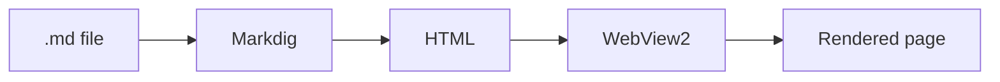

# Markdown Viewer — Sample

A quick document that exercises every rendering feature.

## Text formatting

This is **bold**, *italic*, ~~strikethrough~~, and `inline code`.
An autolink: https://example.com

> A blockquote with a [link](https://github.com).

## Task list

- [x] Render GitHub-Flavored Markdown
- [x] Syntax-highlight code blocks
- [ ] Toggle light / dark theme
- [ ] Draw Mermaid diagrams

## Table

| Feature        | Library      | Offline |
|----------------|--------------|:-------:|
| Markdown → HTML| Markdig      |   ✅    |
| Highlighting   | highlight.js |   ✅    |
| Diagrams       | Mermaid      |   ✅    |

## Code block (syntax highlighting)

```js
const greet = (name) => {
    // template literal + arrow function
    return `Hello, ${name}!`;
};

console.log(greet("Markdown"));
```

```csharp
public static string ToHtml(string markdown) =>
    Markdown.ToHtml(markdown, Pipeline);
```

## Mermaid diagram



## Nested list

1. First
2. Second
   - sub a
   - sub b
3. Third

---

That's it — if everything above looks right, the viewer works.
